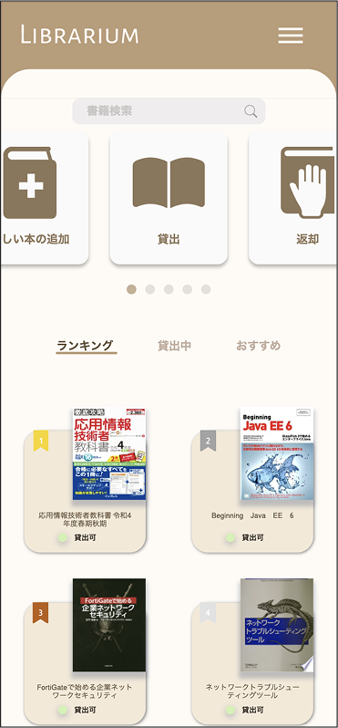
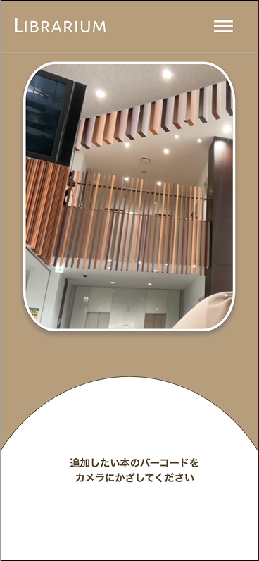
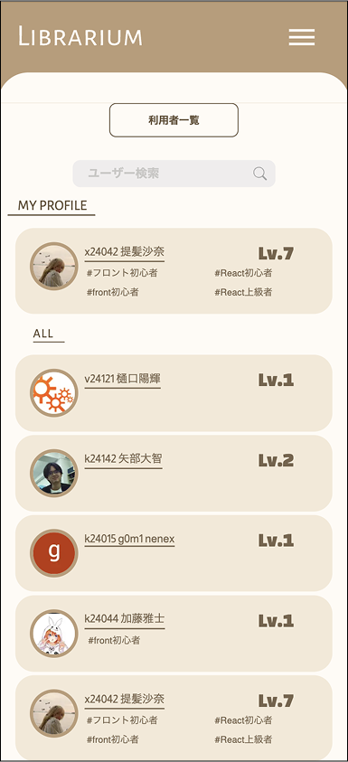
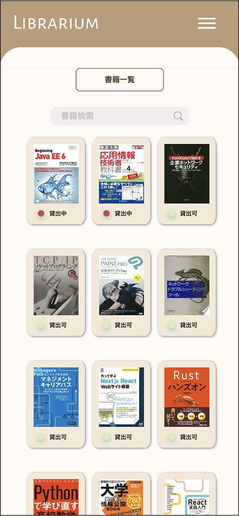
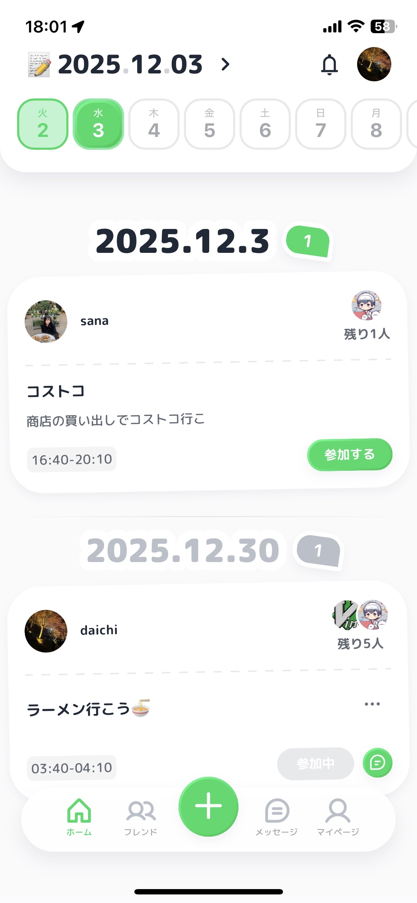
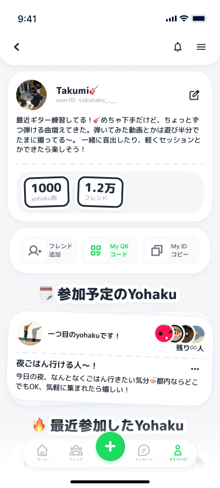

## Sana

## 作品紹介

### Librarium

  
  
  
  

**概要:**  
バーコードで書籍を読み取り、簡単に登録・貸し借りでき、スキルのタグ付けや技術書の相性診断などの機能を備えた書籍管理アプリ

**開発担当:**  
フロントエンド/デザイン

**実績:**  
🏆 シスハック - [Nextend賞]  
🏆 技育博 - [2025/vol.3]

**リポジトリ:**  
🔗 [https://github.com/nrak126/librarium](リンク)

---

### Yo haku

  

 
  

**概要:**  
自分やフレンドの空き時間を交換・共有し、カレンダーやチャット機能で予定調整をスムーズに行えるアプリ

**開発担当:**  
フロントエンド

**受賞実績:**  
🏆 最優秀賞 - 技育キャンプvol.4  
🏆 サイバーエージェント賞 - 技育展

**リポジトリ:**  
🔗 [https://github.com/yohaku-space](リンク)
